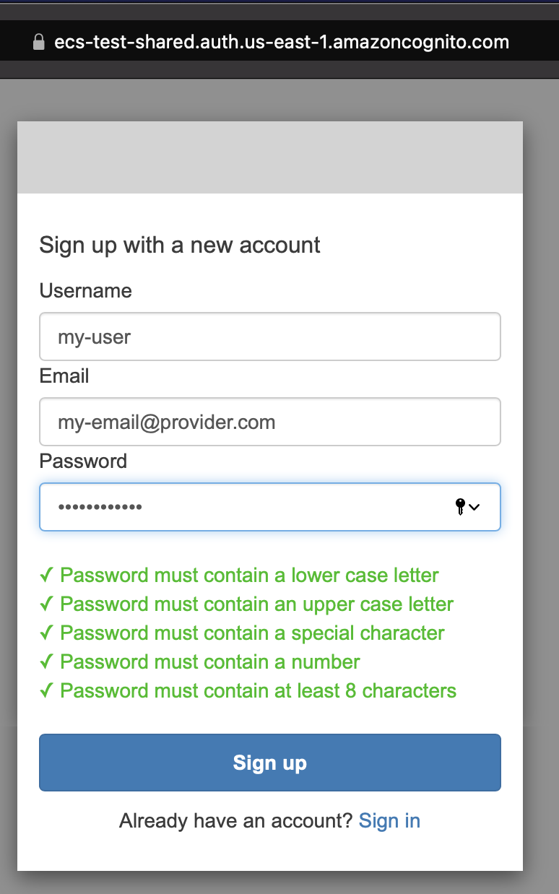
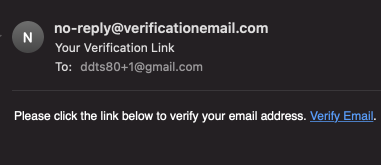
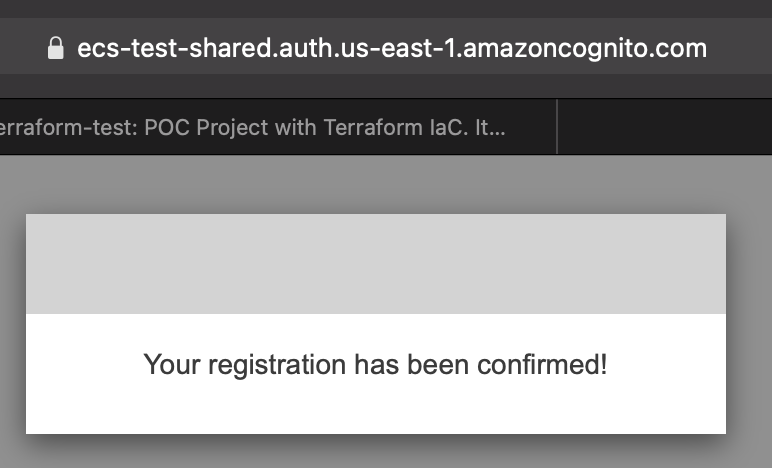
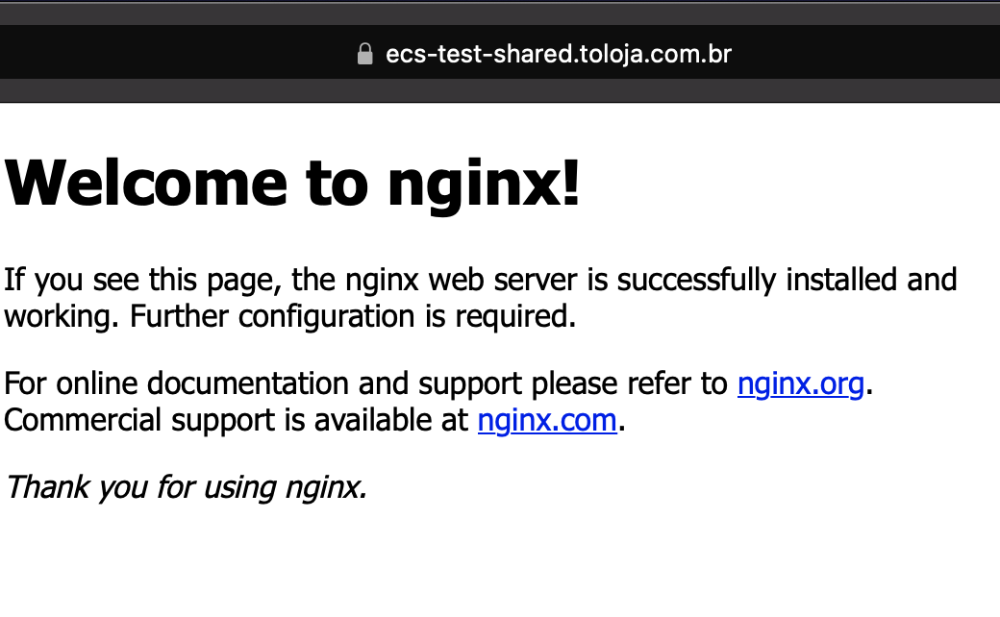

# Terraform Test

POC Project with Terraform IaC. It includes a ECS service running Nginx container and Cognito Authorization.

## Architecture


## Using the app

Available at https://ecs-test-shared.toloja.com.br

The app is protected by authentication, create an account for you:

### Login screen

Click on sign up link to create an account:


### Sign up

Fill username, email and password (password should have minimum of 8 chars, one special char, one letter upper case and lower case, and one number):



### Confirmation flow

You will receive a email to confirm, check your email and click at the link:





### Login with your username and password


### App screen



## AWS credentials

Use [aws-vault](https://github.com/99designs/aws-vault) to manage your credentials or another of your preference.

## Resources

| Name                                     | Description                                                     |
| ---------------------------------------- | --------------------------------------------------------------- |
| [backend](./backend/README.md)           | resources to configure terraform S3 remote state and lock table |
| [shared](./shared/README.md)             | shared resources used by applications                           |
| [modules](./modules/README.md)           | resources to configure terraform S3 remote state and lock table |
| [applications](./applications/README.md) | resources to configure terraform S3 remote state and lock table |

## Requirements

- [terraform cli 0.14.8](https://www.terraform.io/docs/cli/index.html) ([tfswitch](https://tfswitch.warrensbox.com) it's a good option)
- [checkov](https://www.checkov.io)
- [go](https://golang.org)

## Deployment

There is a order to apply all resources:

1. backend
1. shared
1. applications

```
aws-vault exec <your-profile> -d 12h --

cd backend
terraform init
terraform plan -out plan.apply
terraform apply plan.apply

cd -
cd shared
terraform init
terraform plan -out plan.apply
terraform apply plan.apply

cd -
cd applications/nginx-app
terraform init
terraform workspace new stg
terraform workspace new prd
terraform plan -out plan.apply
terraform apply plan.apply

cd -
```

## Testing

There is a basic test in test folder.

## Verifications

### Terraform fmt

```
terraform fmt --recursive
```

### Checkov

```
# with local installation
checkov -d .

# with docker
docker run -v $(pwd):/data --rm -it bridgecrew/checkov -d /data --quiet
```

### Running tests

```
aws-vault exec <your-profile> -d 12h --

cd test
go test

cd -
```

## Clean Up

There is a order to destroy all resources:

1. applications
1. shared
1. backend

```
cd applications/nginx-app
terraform init
terraform plan -out plan.destroy -destroy
terraform apply plan.destroy

cd -
cd shared
terraform init
terraform plan -out plan.destroy -destroy
terraform apply plan.destroy

cd -
cd backend
terraform init
terraform plan -out plan.destroy -destroy
terraform apply plan.destroy

cd -
```

## Roadmap

- Add [moto](https://github.com/gruntwork-io/terratest/tree/master/test-docker-images/moto) for mocked tests
- Add ECR Repository to build a custom image
- Automated plan/apply with Atlantis or Github Actions
