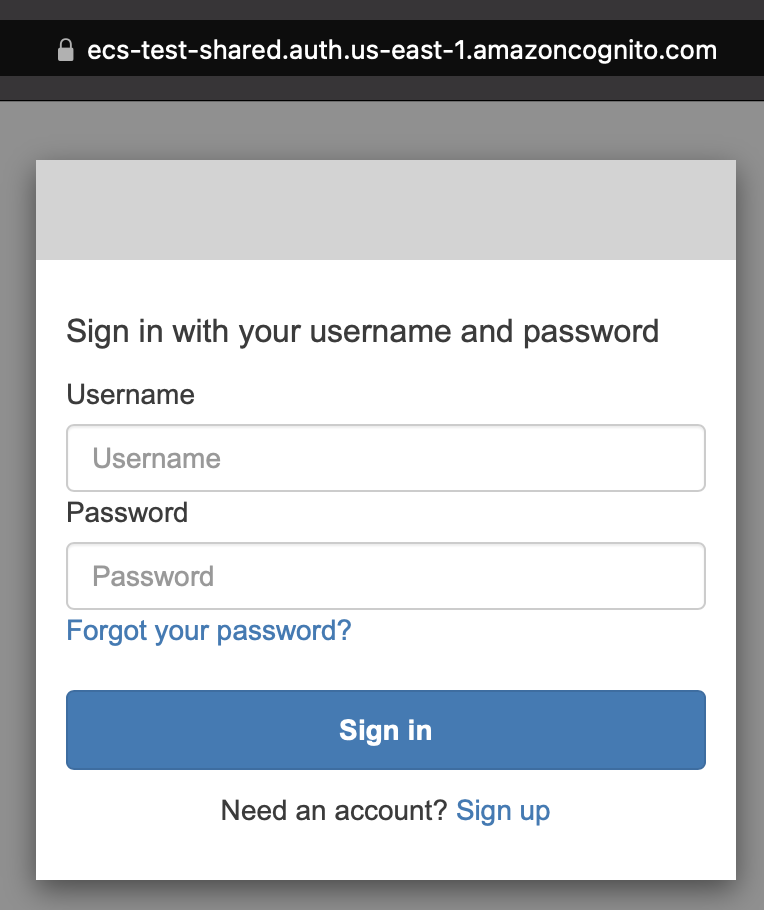
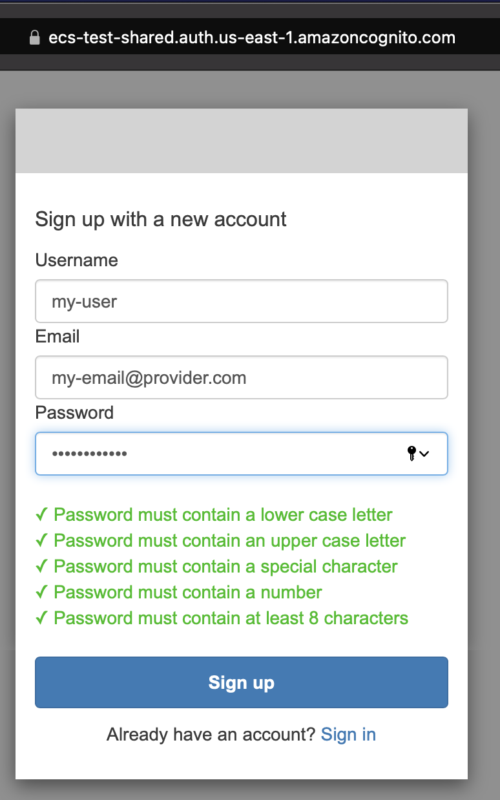
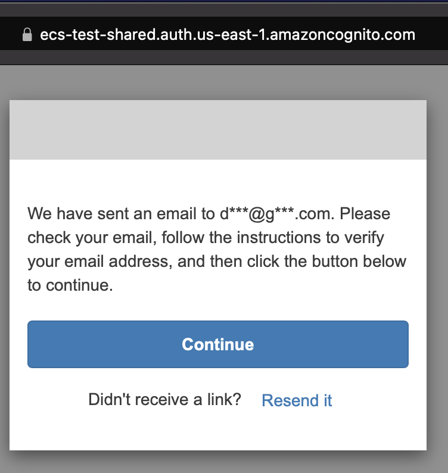
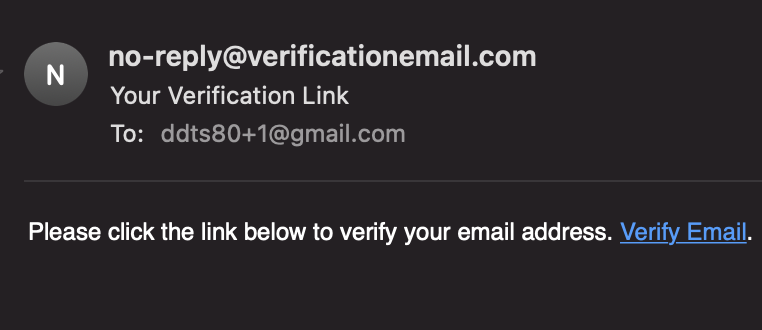
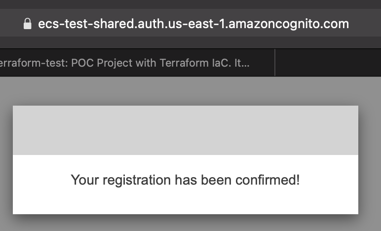
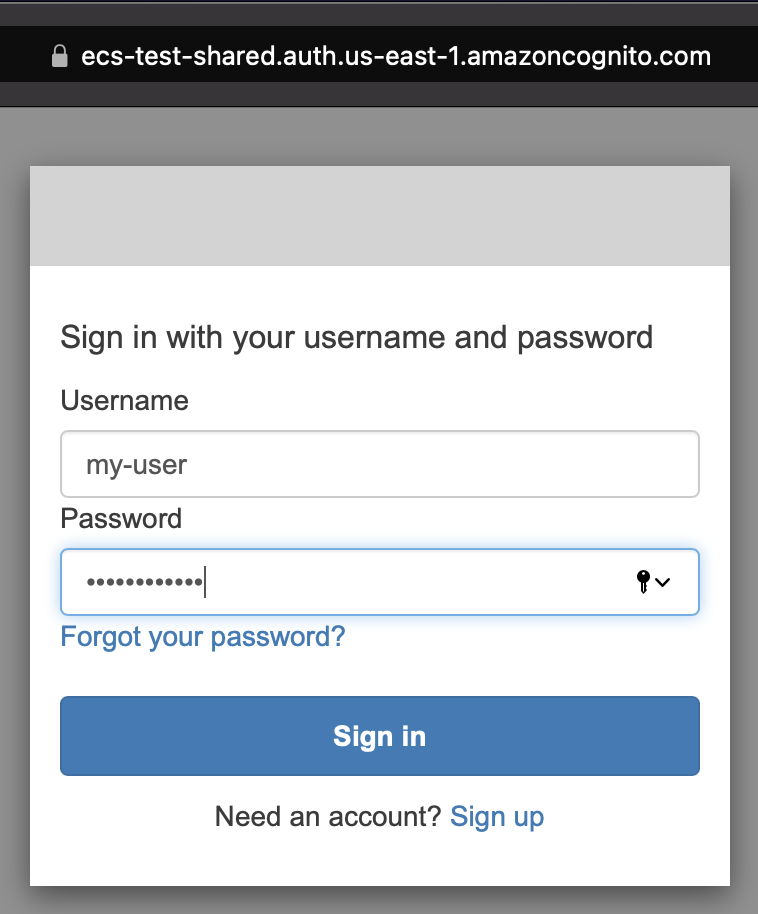
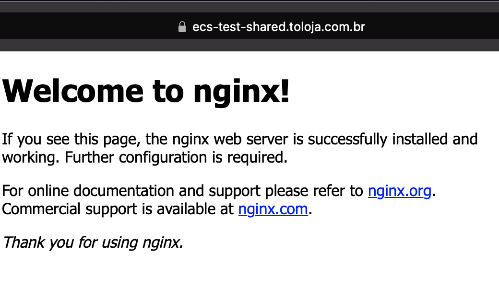

# Nginx App

Hello world Nginx App running in AWS ECS Fargate

## Using the app

Available at https://ecs-test-shared.toloja.com.br

The app is protected by authentication, create an account for you:

### Login screen

Click on sign up link to create an account:



### Sign up

Fill username, email and password (password should have minimum of 8 chars, one special char, one letter upper case and lower case, and one number):



### Confirmation flow

You will receive a email to confirm, check your email and click at the link:





### Login with your username and password



### App screen



## AWS credentials

Use [aws-vault](https://github.com/99designs/aws-vault) to manage your credentials or another of your preference.

## Workspaces

- stg
- prd

| Name                                                                                                    |
| ------------------------------------------------------------------------------------------------------- |
| [module.service](../../modules/ecs-service/README.md)                                                   |
| [module.ecs_sg](https://registry.terraform.io/modules/terraform-aws-modules/security-group/aws/latest)  |
| [module.iam_assumable_role](https://registry.terraform.io/modules/terraform-aws-modules/iam/aws/latest) |

## Variables

| Name   | Description              | Type   | Default   | Required |
| ------ | ------------------------ | ------ | --------- | :------: |
| region | Default region us-east-1 | string | us-east-1 |    no    |

## Outputs

| Name     | Description      |
| -------- | ---------------- |
| env_name | Environment name |

## Deploy

```
terraform init
terraform plan -out plan.apply
terraform apply plan.apply
```

## Clean Up

```
terraform destroy
```
